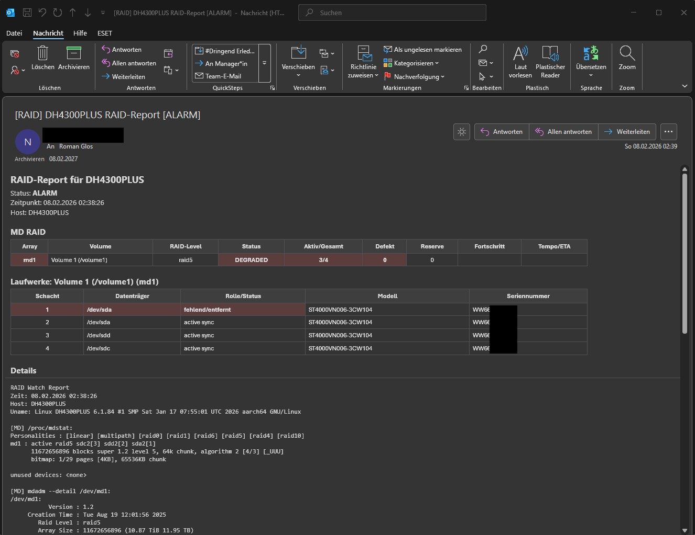
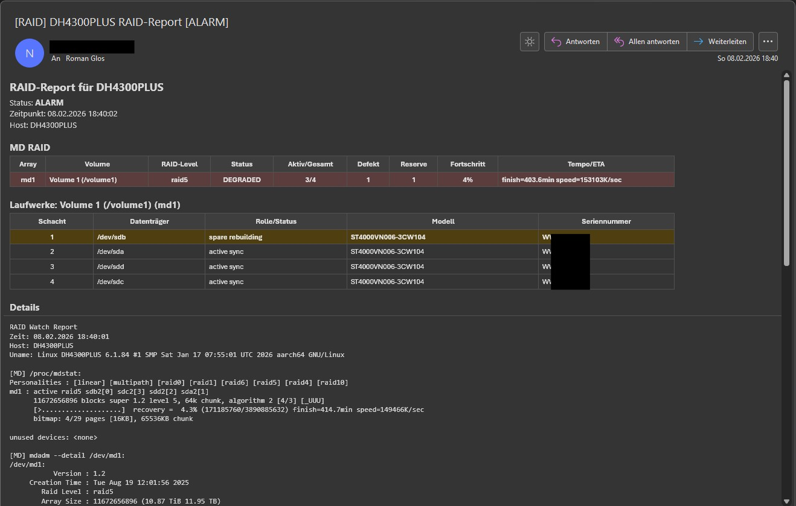
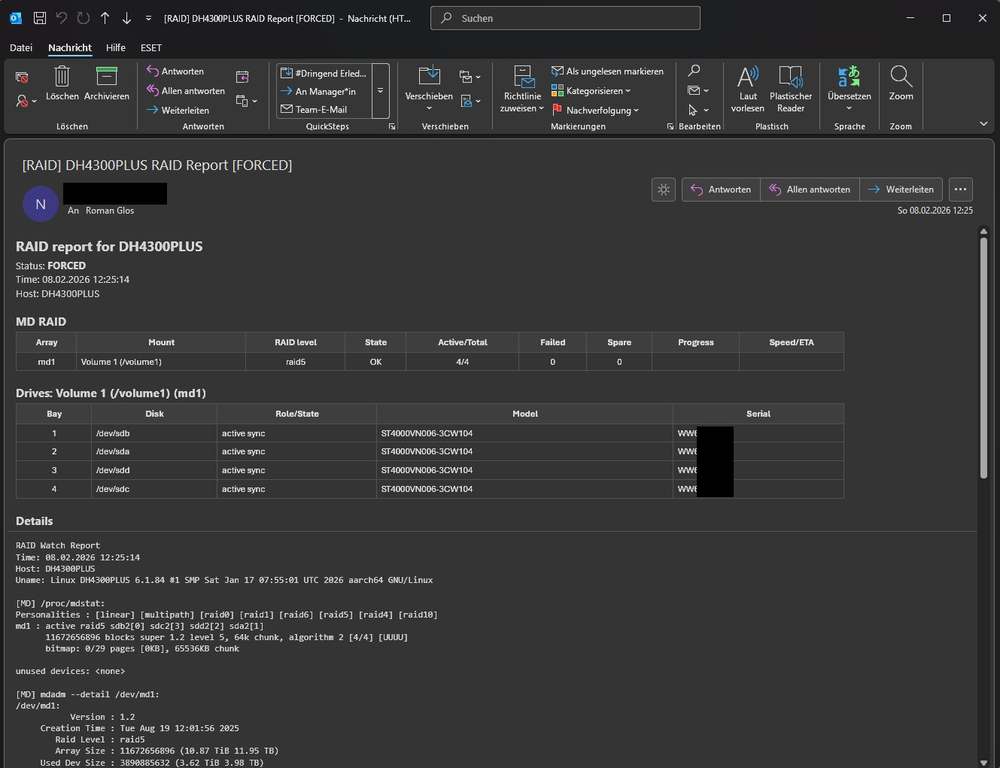
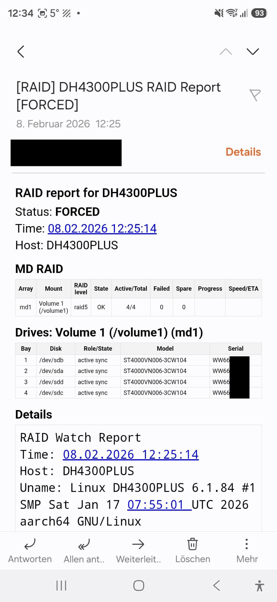

# RaidWatch (UGREEN NAS)

RaidWatch ist ein leichtgewichtiges Bash-Skript für UGREEN NAS (UGOS Pro), das den Storage-Status überwacht und bei Problemen oder Änderungen einen Outlook-freundlichen Report per E-Mail sendet.

## Features

- MD RAID Monitoring (mdadm): erkennt OK, DEGRADED, Rebuild/Resync/Recovery (inkl. Fortschritt, Speed/ETA)
- Korrekte Schacht/Bay-Zuordnung bei MD RAID (über mdadm RaidDevice-Slots)
- Optional: Btrfs-Check (Status/Fehlerindikatoren)
- Outlook-freundlicher HTML-Report (oder Text)
- Cron-tauglich (robuste Erkennung auch ohne interaktives Environment)
- DE/EN Reports (per `REPORT_LANG`)

## Screenshots

### Deutsch (DE)
| ALARM / DEGRADED | RECOVERY / Rebuild |
|---|---|
|  |  |

### Englisch (EN)
| FORCED (Test) | Mobile Ansicht |
|---|---|
|  |  |

> Hinweis: Die Bilder werden über relative Pfade eingebunden und funktionieren direkt im README.

## Projektstruktur

```
raidwatch/
  raidwatch.sh
  raidwatch.env
Screens/
  (Screenshots)
RAIDWatch_Handbuch_Manual_DE-EN_v1.01.pdf
```

## Voraussetzungen

- UGREEN NAS (UGOS Pro)
- Bash
- Für MD RAID: `mdadm` (Vorinstalliert in UGOS Pro)
- Für Mailversand: `python3` (Vorinstalliert in UGOS Pro)

## Installation (Quickstart)

1) Ordner auf das NAS kopieren, z.B.:
`/volumeX/docker/raidwatch/`

2) Konfiguration anpassen:
`raidwatch/raidwatch.env`

3) Testmail senden:
```bash
cd /volumeX/docker/raidwatch
bash ./raidwatch.sh --test-mail
```

4) Einmalig prüfen:
```bash
bash ./raidwatch.sh --once
```

5) Loop-Modus (alle `SLEEP_SECONDS` Sekunden):
```bash
bash ./raidwatch.sh --loop
```

Optional: Mail erzwingen (auch ohne Change/Problem):
```bash
bash ./raidwatch.sh --once --force
```

## Konfiguration

Alle Einstellungen stehen in `raidwatch/raidwatch.env` (SMTP, Empfänger, Checks, Sprache, Cooldown usw.).

## Dokumentation

- Handbuch (PDF): `RAIDWatch_Handbuch_Manual_DE-EN_v1.01.pdf`

## Version

- v1.01
